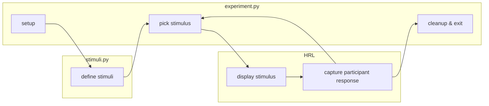

# Showing a list of stimuli, navigating through them

This folder demonstrates
-- and can serve as a template for --
the basics of displaying a list of stimuli,
and being able to navigate through this list.

Additionally, it demonstrates some modularity:
all the stimuli are defined in a separate `stimuli.py` module;
and functionality to display stimuli and process responses are turned into functions.



## - Installation

This demo uses [stimupy](https://github.com/computational-psychology/stimupy) to generate the stimuli:
```bash
pip install stimupy
```

Additionally, it requires having [HRL](https://github.com/computational-psychology/hrl) installed:
```bash
pip install https://github.com/computational-psychology/hrl/archive/master.zip
```