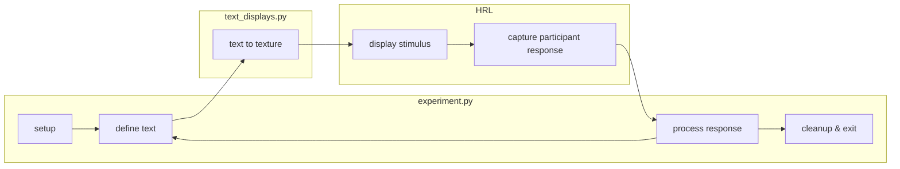

# Showing text to participant

This folder demonstrates
-- and can serve as a template for --
the basics of displaying text to the participant.

The functionality for this partially abstracted out
in the `text_displays.py` module;
in later demonstrations / templates,
this module will be included as well with more content.

## Overview



## Dependencies

This demo uses [Pillow (PIL)](https://pillow.readthedocs.io/en/stable/) to draw text:
```bash
pip install Pillow
```

Additionally, it requires having [HRL](https://github.com/computational-psychology/hrl) installed:
```bash
pip install https://github.com/computational-psychology/hrl/archive/master.zip
```