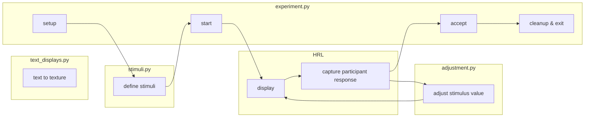

# Method of Adjustment

This folder demonstrates
-- and can serve as a template for --
the basics of running a Method of Adjustment experiment.

As in previous demos,
`stimuli.py` contains the definitions for the stimuli,
and `text_displays` contains the functionality for drawing displays.
Additionally, `adjustment.py` contains the functionality
for using button presses to adjust (stimulus) values.

## Overview



## Dependencies

This demo uses [Pillow (PIL)](https://pillow.readthedocs.io/en/stable/) to draw text:
```bash
pip install Pillow
```
and [stimupy](https://github.com/computational-psychology/stimupy) to generate the stimuli:
```bash
pip install stimupy
```


Additionally, it requires having [HRL](https://github.com/computational-psychology/hrl) installed:
```bash
pip install https://github.com/computational-psychology/hrl/archive/master.zip
```