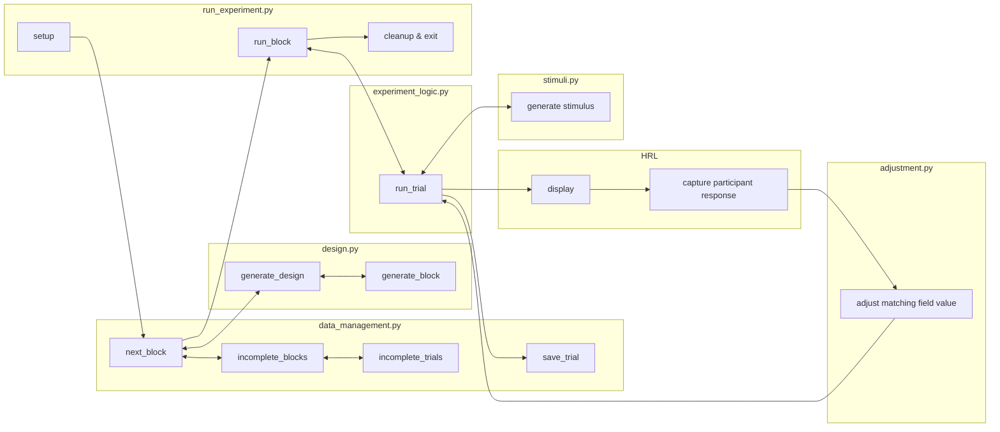

# Mutua matching, generating stimuli "online"

## Overview


## Installation
This demo uses:
- [stimupy](https://github.com/computational-psychology/stimupy)
- [pandas](https://pandas.pydata.org/), to manage data
- [Pillow (PIL)](https://pillow.readthedocs.io/en/stable/), for text
- [HRL](https://github.com/computational-psychology/hrl)

```bash
python -m pip install pandas, Pillow, stimupy
python -m pip install https://github.com/computational-psychology/hrl/archive/master.zip
```