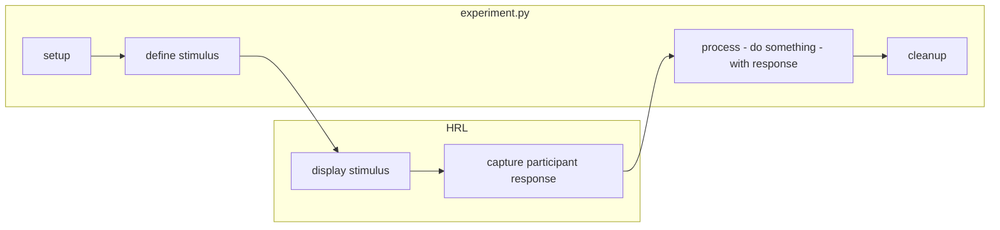

# Basic experiment code using HRL

This folder demonstrates
-- and can serve as a template for --
 the basics of running an experiment.

In general, coding up an experiment requires:
- displaying some stimulus (e.g., an image)
- collecting some responses (e.g., button presses) from a participant

There are many tools and libraries available to take care of some of the technicalities,
such as interacting with hardware (monitor, keyboard/buttonbox).
Here, we use our [HRL](https://github.com/computational-psychology/hrl) package
to display stimuli and capture responses.

In addition to these core tasks, an experiment also involves
- defining, generating, or loading what stimulus/stimuli to use
- processing the captured participant responses (e.g., saving, presenting a new stimulus,...)
- coordinating these various steps

For that, we as the experiment will have to write our own code
-- in this demo/template that is `experiment.py`



## - Installation

Install [HRL](https://github.com/computational-psychology/hrl):
```bash
pip install https://github.com/computational-psychology/hrl/archive/master.zip
```

This will also install the required dependencies:
- [PyOpenGL](https://pyopengl.sourceforge.net/) (`pyopengl`)
- [PyGame](https://www.pygame.org/) (`pygame`)
- [NumPy](https://numpy.org/) (`numpy`)

## 0. Setup
To use HRL's functionality, we have to create a specific `hrl`-object.
We can then use methods from this object, to control the display
and get responses.
This takes some arguments, such as:
- `wdth`,`hght`: the resolution (width and height) of the window to draw
- `fs`: whether to fullscreen the window
- `scrn`: index of which screen (monitor) to use in a multimonitor setup
- `inputs`: which input device to use
- `graphics`: which graphics device to use
- `lut`: (filepath to) LookUp Table mapping input intensity (0.0,1.0) to monitor intensities

```python
from hrl import HRL

# Create HRL interface object
ihrl = HRL(
    graphics="gpu",  # Use the default GPU as graphics device driver
    # graphics='datapixx',    # In the lab, we use the datapixx or viewpixx device driver
    lut="lut.csv",  # filepath to (color) LookUp Table, mapping input intensity (0.0,1.0) to monitor intensities
    inputs="keyboard",  # Use the keyboard as input device driver
    # inputs="responsepixx",  # In the lab, we use the responsepixx input device
    hght=768,
    wdth=1024,
    scrn=0,  # Which screen (monitor) to use
    fs=False,  # Fullscreen?
)
```

### (color) LookUp Table
In vision research, we (often) want to be sure about exactly what light the monitor is putting out.
To know this, we take careful measurements and _calibrate_ our display devices.
Specifically, we measure the _luminance_ (in $cdm^{-2}$) of the light coming from the monitor,
as a function of the intensity value (float between `0.0` and `1.0`;
which corresponds to the RGB value `int` between `0` and `255`).

However, for most display devices, this relationship is not _linear_:
a step in intensity from `0.0` to `.25` leads to a much smaller increase in luminance,
than an equal step in intensity from `.75` to `1.0`!
The exact shape of this relationship is known as the _gamma_ of the device,
is different between different monitors, and can change over time as well.

To correct for the gamma, we _calibrate_ the device:
measure the whole gamma function in 256 steps,
and figure out what the steps _should be_ to get a linear relationship
between input intensity value (between `0.0` and `1.0`) and output luminance (in $cdm^{-2}$).
This _gamma-corrected_ function is stored in a (Color) LookUp Table ([C]LUT),
which maps an input intensity value `x` (i.e., the values in the stimulus)
to the monitor intensity value that corresponds to `\frac{x}{256}` of the monitor max luminance:

| IntensityIn |  IntensityOut | Luminance ($cdm^{-2}$) |
| ----------- | ------------- | ---------------------- |
| 0.0         | 0.0           | 0.0034                 |
| 0.00024     | 0.05490       | 0.1334                 |
| 0.00049     | 0.07058       | 0.2820                 |
 ...
| 0.98485     | 0.99607       | 498.88                 |
| 0.99413     | 1.0           | 501.90                 |

HRL can automatically use the LUT to convert intensities,
such that we only have to think about input intensities linear spaced between `0.0` and `1.0`.
Since the LUT is different for different setups
we need to provide (a filepath to) the specific LUT when instantiating the HRL-object
using `lut=` argument.
In the lab setups, the specific `lut`s can be found in the `~/luts/` directory
in subdirectories with YYYYMMDD datestamps (e.g., 20230626 for June 26th 2023) --
be sure to use the most recent LUT!

### Different setups
The exact values passed for the parameters depends on which physical hardware setup is used.
On a personal setup, laptop, etc, we use:
```
graphics="gpu", # default graphics driver
inputs="keyboard", # default keyboard
#lut, # no measured LUT anyway
scrn=0, # default main (virtual)screen
fs=False # easier to manage
```
and whatever resolution (`hght, wdth`) you want.

In the lab, we have two setups.
The ViewPixx setup (with eyetracker):
```
graphics="viewpixx",
inputs="responsepixx",
lut="lut_viewpixx.csv", # get the latest from ~/luts/ on that machine
scrn=1,
fs=True,
hght=1080,
wdth=1920,
```
The high-luminance range Siemens monitor:
```
graphics="datapixx",
inputs="responsepixx",
lut="lut.csv", # get the latest from ~/luts/ on that machine
scrn=1,
fs=True,
hght=1024,
wdth=768,
```

## 1. Define stimulus
In order to display a stimulus,
we first have to define/load/create a stimulus.
There are many ways to do so,
e.g., load an image from a file.
Here, create an image-matrix (np.ndarray) with 256x256 random values
```python
import numpy as np

rng = np.random.default_rng()
stim_image = rng.standard_normal(size=(256, 256))
```

## 2. Display stimulus
To display on the screen HRL uses frame buffers.
We can draw OpenGL primitives and textures on a frame buffer
and then when we want to display that on the screen,
we "flip" the buffer.

First, we convert our stimulus to an OpenGL texture,
then we place that on the frame buffer,
and then we flip the buffer

```python
# Convert the stimulus image(matrix) to an OpenGL texture
stim_texture = ihrl.graphics.newTexture(stim_image)

# Determine position: we want the stimulus in the center of the frame
CENTER = (SHAPE[0] // 2, SHAPE[1] // 2)  # Center of the drawing window
pos = (CENTER[1] - (stim_texture.wdth // 2), CENTER[0] - (stim_texture.hght // 2))

# Create a display: draw texture on the frame buffer
stim_texture.draw(pos=pos, sz=(stim_texture.hght, stim_texture.wdth))

# Display: flip the frame buffer
ihrl.graphics.flip(clr=True)  # also `clear` the frame buffer
```

The stimulus display will then stay on the screen
until either another `.flip()` is called,
or the hrl-object is `.close()`'d

## 3. Capture participant response
After displaying some stimulus, we often want some response from the participant.
This generally requires two steps:
- capturing the response via some input hardware (e.g., keyboard, button box)
- "processing" the response, i.e., deciding what to do with it
  (determine next stimulus, record to disk, etc.)

HRL also provides functionality to interact with input hardware.
The high-level interface is `<hrl_object>.inputs.readButton()`,
which waits for a (single) button press.

By default, `readButton` waits until one of the following buttons is pressed:
"Up", "Down", "Right", "Left", "Space", "Escape"
```python
ihrl.inputs.readButton()

print("Participant pressed a button")
```

`readButton`can also be asked to respond to only some buttons
and ignore all others:
```python
ihrl.inputs.readButton(btns=("Right", "Space", "Left", "Escape"))

print("Participant pressed a button")
```

`readButton` also returns a tuple
of a string-descriptor of the button pressed,
and the response delay (i.e., time until button was pressed).
```python
button, t1 = ihrl.inputs.readButton()

print(f"Participant pressed {button} after {t1}s")
```

## 4. Process response
Having captured a response, we need to process it.
This can include all kinds of steps, for instance
deciding if the response is "correct" or not (in tasks where this is possible);
storing the response (and additional information) as results data;
deciding what the next trial & stimulus will be.

```python
# Assign responses to correct/incorreect
response_correct = {"Right": True, "Left": False, "Escape": False}

if response_correct[button]:
    print(f"Participant pressed {button}, which is correct")
else:
    print(f"Participant pressed {button}, which is incorrect")
```

How exactly the response is mapped to some action
depends heavily on the experiment and task.
For example, in a Method of Forced Choice experiment,
the response is converted to correct/incorrect,
recorded as a result, and a new trial is presented.

In a Method of Adjustment task
the response leads to increasing/decreasing some stimulus level.
In these experiments, a button press will lead to a new _stimulus display_,
but not immediately to recording a new result.
Only when some other button is pressed to _accept_ a match,
then the result is recorded and a new trial is started.


## Cleanup
After the whole experiment is done 
(or if the participant/experimenter wants to terminate earlier),
some cleanup is required:
the connection to display and input hardware should be closed.
This can be done using the `.close()` method of the HRL-object.
```python
ihrl.close()
```